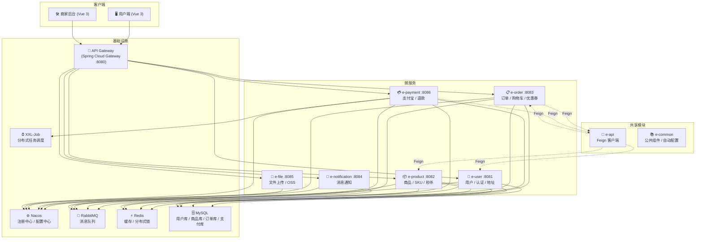

# 🛒 E-Commerce 微服务电商平台

基于 Spring Cloud Alibaba 的全栈多商户电商平台，采用微服务架构，支持高并发秒杀、支付宝支付、优惠券系统等核心电商功能。

## 📐 系统架构



## 🛠️ 技术栈

| 层级 | 技术 | 版本 |
|------|------|------|
| **后端框架** | Spring Boot + Spring Cloud + Spring Cloud Alibaba | 2.7.12 / 2021.0.3 / 2021.0.1.0 |
| **网关** | Spring Cloud Gateway | 2021.0.3 |
| **注册/配置** | Nacos | — |
| **数据库** | MySQL 8.0 + MyBatis Plus | 8.0.23 / 3.5.3.1 |
| **缓存** | Redis + Redisson (分布式锁) | 3.13.6 |
| **消息队列** | RabbitMQ | — |
| **定时任务** | XXL-Job | 2.3.1 |
| **分布式事务** | Seata (AT 模式) | 1.5.1 |
| **支付** | 支付宝开放平台 SDK | — |
| **对象存储** | 阿里云 OSS / 腾讯云 COS | — |
| **API 文档** | Swagger / Knife4j | 3.0.3 |
| **前端** | Vue 3 + Vite + Pinia + TailwindCSS 4 + Element Plus | — |
| **构建工具** | Maven | — |

## 📦 模块结构

```
ecommerceSystem/
├── e-gateway/         # 🚪 API 网关 (JWT 鉴权、路由转发、CORS)
├── e-user/            # 👤 用户服务 (注册/登录、角色管理、收货地址)
├── e-product/         # 📦 商品服务 (SPU/SKU、分类、秒杀活动)
├── e-order/           # 📋 订单服务 (下单、购物车、优惠券、退款)
├── e-payment/         # 💳 支付服务 (支付宝支付、退款、XXL-Job 对账)
├── e-notification/    # 🔔 通知服务 (订单通知、系统消息)
├── e-file/            # 📁 文件服务 (图片上传、OSS/COS 存储)
├── e-api/             # 🔗 Feign 接口定义 (跨服务调用契约)
└── e-common/          # 📚 公共模块 (自动配置、全局异常、工具类)
```

## ✨ 核心功能

### 🏪 用户端
- 商品浏览、搜索、分类筛选
- 多规格 SKU 选择（PC 端内联 + 移动端底部弹出面板）
- 购物车管理 + 直接购买
- 支付宝支付（PC 网页支付）
- 订单全生命周期（待支付 → 已支付 → 已发货 → 已完成）
- 订单退款（退款中 → 已退款）
- 优惠券领取与使用
- 个人中心（收货地址、资料编辑、密码修改）
- 申请开店

### 🛠️ 商家后台
- 商品管理（上架/下架/编辑/多规格 SKU）
- 订单管理（发货、完成、筛选）
- 秒杀活动管理（限时、限量、每人限购）
- 优惠券管理（满减券）
- 通知系统（新订单提醒）

### ⚡ 高并发设计
- **秒杀系统**: Redis Lua 原子扣减库存 + RabbitMQ 异步下单 + 定时补回超时库存
- **支付对账**: XXL-Job 定时任务 + 支付宝主动查单双保险
- **订单超时**: RabbitMQ 延时队列 30 分钟自动取消
- **分布式锁**: Redisson `@Lock` 注解声明式加锁
- **库存同步**: MQ 异步批量同步 Redis 库存到 MySQL

### 🔐 安全
- JWT 无状态鉴权（Gateway 全局过滤器）
- BCrypt 密码加密
- 接口级角色权限控制（用户/商家/管理员）
- Feign 调用上下文透传

## 🚀 快速启动

### 环境要求
- JDK 11+
- Maven 3.6+
- MySQL 8.0
- Redis 6+
- RabbitMQ 3.x
- Nacos 2.x
- XXL-Job 2.3.x

### 1. 启动基础设施

确保 MySQL、Redis、RabbitMQ、Nacos、XXL-Job 均已启动。

### 2. 导入 Nacos 配置

将 `ecommerceSystem/` 下的 Nacos 共享配置导入 Nacos 控制台：
- `shared-spring.yaml` — Spring 通用配置
- `shared-mybatis.yaml` — MyBatis 数据源配置
- `shared-redis.yaml` — Redis / Redisson 配置
- `shared-mq.yaml` — RabbitMQ 配置
- `shared-xxljob.yaml` — XXL-Job 配置
- `shared-logs.yaml` — 日志配置

### 3. 初始化数据库

创建 4 个数据库并执行建表脚本：
- `ecommerce_user` — 用户、地址
- `ecommerce_product` — 商品、分类、SKU、秒杀
- `ecommerce_order` — 订单、购物车、优惠券
- `ecommerce_payment` — 支付记录、退款记录

### 4. 启动微服务（按顺序）

```bash
cd ecommerceSystem

# 1. 先编译共享模块
mvn clean install -pl e-common,e-api -DskipTests

# 2. 启动网关
mvn spring-boot:run -pl e-gateway

# 3. 启动业务服务（无顺序依赖）
mvn spring-boot:run -pl e-user
mvn spring-boot:run -pl e-product
mvn spring-boot:run -pl e-order
mvn spring-boot:run -pl e-payment
mvn spring-boot:run -pl e-notification
mvn spring-boot:run -pl e-file
```

### 5. 启动前端

```bash
# 用户端 (localhost:5173)
cd frontend
npm install
npm run dev

# 商家后台 (localhost:5174)
cd admin-frontend
npm install
npm run dev
```

## 📡 API 文档

启动各服务后，访问 Swagger 文档：
- 用户服务: `http://localhost:8081/doc.html`
- 商品服务: `http://localhost:8082/doc.html`
- 订单服务: `http://localhost:8083/doc.html`
- 支付服务: `http://localhost:8086/doc.html`

完整接口文档另见 [`API_and_DB_Design.md`](./API_and_DB_Design.md)，包含 84 个接口及响应示例。

## 🗂️ 数据库设计

- 4 个业务数据库（用户 / 商品 / 订单 / 支付）
- 14 张核心表
- 读写分离候选架构

详细表结构与字段说明见 [`API_and_DB_Design.md`](./API_and_DB_Design.md) 第 3 章。

## 🖼️ 项目截图

> 待补充 — 欢迎提交 PR 添加演示截图

## 📄 License

MIT License

---

⭐ 如果这个项目对你有帮助，欢迎 Star！
